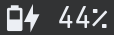

An overview of the project&rsquo;s directory structure. Folders end in `/`, files end in an extension, and other headings are just explanatory.

# assets/

## fonts/

The three fonts used in this rice are Mononoki Nerd Font, Ubuntu Mono Nerd Font, and Open Sans. I&rsquo;ve included tarballs for the `.ttf` files in this directory. I&rsquo;ve also added the Ostrich Sans font used by Qubes, though I haven&rsquo;t yet found a place for it.

Because you shouldn&rsquo;t copy a random tarball into *dom0* in a production environment, here&rsquo;s the links to the download page for each font so you can download the font files yourself:

1.  Mononoki Nerd Font: <https://www.nerdfonts.com/font-downloads>.
2.  Ubuntu Mono Nerd Font: <https://www.nerdfonts.com/font-downloads>.
3.  Open Sans: <https://github.com/googlefonts/opensans> (under `/fonts/ttf/`).
4.  Ostrich Sans: <https://github.com/theleagueof/ostrich-sans> (the `.otf` files).

You should make sure you use a *proportional* nerd font if you don&rsquo;t want issues with icons taking up too much or too little horizontal space.

## unused/

Unused assets.

## `icons.txt` - list of icons for your own use

## `qubes-logo-icon-dark.png`

## `qubes-logo-icon.png`

# bin/

Shell scripts, typically for wibar widgets.

## `autorun.sh`

Run anything soon after Awesome starts.

## `battery.sh`

Return something like .

## `brightness.sh`

Return something like .

## `clipboard.sh`

Uses `stat` to get the size of the global clipboard file in *dom0*. If there are security risks to this I&rsquo;d appreciate knowing.

## `clock.sh`

Return something like  (8 o&rsquo;clock), which is the clock icon showing the current hour (does not track minutes).

## `cpu.sh`

Broken attempt at getting CPU load as a percentage.

## `memory.sh`

Broken attempt at getting total RAM usage in GiB.

## `qube-count.sh`

Return information about currently running VMs as something like . In order, from left to right, and as indicated by the icons, this gives the total number of running VMs, and then the number of running `sys-` VMs, DispVMs, and TemplateVMs.

# core/

Where `rc.lua` went.

## bar/

### `bar.lua`

The `awful.screen.connect_for_each_screen(s)` function:

1.  Set the wallpaper
2.  Create the `layoutbox`, `tasklist`, and `taglist` widgets because they need the `screen` object parameter of the parent function.
3.  Create the wibox
4.  Add widgets to the wibar with the proper layout.

### `widgets.lua`

Source widgets from `widgets/`  and return them in a table:

-   Battery percent
-   Brightness level
-   Clipboard status
-   Date and time (to which the calendar is connected)
-   Kernel version
-   Keyboard status
-   Qube count status
-   System widget (logout, poweroff, screenlock)
-   System tray
-   Qubes menu
-   Qubes launcher
-   Horizontal spacing widget (reusable)

## bindings/

### My Bindings

The Vim motion keys (h,j,k,l) are reserved for client and layout manipulation. I try to match a keybinding with a key that is the first letter of something relevant to the binding&rsquo;s functionality (e.g. &ldquo;c&rdquo; to &ldquo;close&rdquo; the client).

I use `mod shift` for keybindings which slightly change the functionality of the equivalent `mod` binding, or when an easy-to-reach modifier key is needed for a significant binding (e.g. `mod shift c` for closing a client).

I use `mod ctrl` for particularly destructive bindings (like shutdown), or for a keybinding which is similar enough to its equivalent `mod` or `mod shift` bindings.

<table border="2" cellspacing="0" cellpadding="6" rules="groups" frame="hsides">

<colgroup>
<col  class="org-left" />

<col  class="org-left" />

<col  class="org-left" />

<col  class="org-left" />
</colgroup>
<thead>
<tr>
<th scope="col" class="org-left">Group</th>
<th scope="col" class="org-left">Modifier(s)</th>
<th scope="col" class="org-left">Other Key(s)</th>
<th scope="col" class="org-left">Functionality</th>
</tr>
</thead>

<tbody>
<tr>
<td class="org-left">&#xa0;</td>
<td class="org-left">&#xa0;</td>
<td class="org-left">Mouse 1</td>
<td class="org-left">raise client</td>
</tr>

<tr>
<td class="org-left">&#xa0;</td>
<td class="org-left">mod</td>
<td class="org-left">Mouse 1</td>
<td class="org-left">move client</td>
</tr>

<tr>
<td class="org-left">&#xa0;</td>
<td class="org-left">mod</td>
<td class="org-left">Mouse 3</td>
<td class="org-left">resize client</td>
</tr>

<tr>
<td class="org-left">client</td>
<td class="org-left">mod</td>
<td class="org-left">j</td>
<td class="org-left">focus next client by index</td>
</tr>

<tr>
<td class="org-left">&#xa0;</td>
<td class="org-left">mod</td>
<td class="org-left">k</td>
<td class="org-left">focus previous client by index</td>
</tr>

<tr>
<td class="org-left">&#xa0;</td>
<td class="org-left">mod shift</td>
<td class="org-left">j</td>
<td class="org-left">swap with next client by index</td>
</tr>

<tr>
<td class="org-left">&#xa0;</td>
<td class="org-left">mod shift</td>
<td class="org-left">k</td>
<td class="org-left">swap with previous client by index</td>
</tr>

<tr>
<td class="org-left">&#xa0;</td>
<td class="org-left">mod</td>
<td class="org-left">f</td>
<td class="org-left">toggle fullscreen</td>
</tr>

<tr>
<td class="org-left">&#xa0;</td>
<td class="org-left">mod shift</td>
<td class="org-left">c</td>
<td class="org-left">close</td>
</tr>

<tr>
<td class="org-left">&#xa0;</td>
<td class="org-left">mod ctrl</td>
<td class="org-left">space</td>
<td class="org-left">toggle floating</td>
</tr>

<tr>
<td class="org-left">&#xa0;</td>
<td class="org-left">mod</td>
<td class="org-left">o</td>
<td class="org-left">move to next screen</td>
</tr>

<tr>
<td class="org-left">&#xa0;</td>
<td class="org-left">mod shift</td>
<td class="org-left">o</td>
<td class="org-left">move to previous screen</td>
</tr>

<tr>
<td class="org-left">&#xa0;</td>
<td class="org-left">mod</td>
<td class="org-left">c</td>
<td class="org-left">center in screen</td>
</tr>

<tr>
<td class="org-left">layout</td>
<td class="org-left">mod</td>
<td class="org-left">space</td>
<td class="org-left">select next layout</td>
</tr>

<tr>
<td class="org-left">&#xa0;</td>
<td class="org-left">mod shift</td>
<td class="org-left">space</td>
<td class="org-left">select previous layout</td>
</tr>

<tr>
<td class="org-left">&#xa0;</td>
<td class="org-left">mod</td>
<td class="org-left">l</td>
<td class="org-left">increase master area</td>
</tr>

<tr>
<td class="org-left">&#xa0;</td>
<td class="org-left">mod</td>
<td class="org-left">h</td>
<td class="org-left">decrease master area</td>
</tr>

<tr>
<td class="org-left">&#xa0;</td>
<td class="org-left">mod shift</td>
<td class="org-left">h</td>
<td class="org-left">increase the number of master clients</td>
</tr>

<tr>
<td class="org-left">&#xa0;</td>
<td class="org-left">mod shift</td>
<td class="org-left">l</td>
<td class="org-left">decrease the number of master clients</td>
</tr>

<tr>
<td class="org-left">screen</td>
<td class="org-left">mod</td>
<td class="org-left">w</td>
<td class="org-left">focus the previous screen</td>
</tr>

<tr>
<td class="org-left">&#xa0;</td>
<td class="org-left">mod</td>
<td class="org-left">e</td>
<td class="org-left">focus the next screen</td>
</tr>

<tr>
<td class="org-left">&#xa0;</td>
<td class="org-left">mod shift</td>
<td class="org-left">w</td>
<td class="org-left">move client to previous screen</td>
</tr>

<tr>
<td class="org-left">&#xa0;</td>
<td class="org-left">mod shift</td>
<td class="org-left">e</td>
<td class="org-left">move client to next screen</td>
</tr>

<tr>
<td class="org-left">terminals</td>
<td class="org-left">mod</td>
<td class="org-left">return</td>
<td class="org-left">open terminal in focused client VM</td>
</tr>

<tr>
<td class="org-left">&#xa0;</td>
<td class="org-left">mod shift</td>
<td class="org-left">return</td>
<td class="org-left">open terminal in dom0</td>
</tr>

<tr>
<td class="org-left">&#xa0;</td>
<td class="org-left">mod ctrl</td>
<td class="org-left">return</td>
<td class="org-left">open terminal in VM chosen in dmenu</td>
</tr>

<tr>
<td class="org-left">tag</td>
<td class="org-left">mod</td>
<td class="org-left">Tab</td>
<td class="org-left">focus previous tag</td>
</tr>

<tr>
<td class="org-left">multimedia</td>
<td class="org-left">&#xa0;</td>
<td class="org-left">XF86AudioRaiseVolume</td>
<td class="org-left">raise volume</td>
</tr>

<tr>
<td class="org-left">&#xa0;</td>
<td class="org-left">&#xa0;</td>
<td class="org-left">XF86AudioLowerVolume</td>
<td class="org-left">lower volume</td>
</tr>

<tr>
<td class="org-left">VM apps</td>
<td class="org-left">mod</td>
<td class="org-left">g</td>
<td class="org-left">work &gt; emacsclient</td>
</tr>

<tr>
<td class="org-left">&#xa0;</td>
<td class="org-left">mod</td>
<td class="org-left">s</td>
<td class="org-left">school &gt; brave browser</td>
</tr>

<tr>
<td class="org-left">&#xa0;</td>
<td class="org-left">mod</td>
<td class="org-left">t</td>
<td class="org-left">thunderbird &gt; thunderbird</td>
</tr>

<tr>
<td class="org-left">&#xa0;</td>
<td class="org-left">mod</td>
<td class="org-left">m</td>
<td class="org-left">signal &gt; signal desktop</td>
</tr>

<tr>
<td class="org-left">dom0 dmenu</td>
<td class="org-left">mod</td>
<td class="org-left">b</td>
<td class="org-left">launch DispVM browser</td>
</tr>

<tr>
<td class="org-left">&#xa0;</td>
<td class="org-left">mod</td>
<td class="org-left">d</td>
<td class="org-left">choose word &gt; work &gt; emacsclient dictionary</td>
</tr>

<tr>
<td class="org-left">&#xa0;</td>
<td class="org-left">mod</td>
<td class="org-left">n</td>
<td class="org-left">choose VM and new NetVM</td>
</tr>

<tr>
<td class="org-left">&#xa0;</td>
<td class="org-left">mod</td>
<td class="org-left">r</td>
<td class="org-left">run dom0 application or VM application</td>
</tr>

<tr>
<td class="org-left">&#xa0;</td>
<td class="org-left">mod shift</td>
<td class="org-left">r</td>
<td class="org-left">start/stop/restart/pause/unpause/kill any qube</td>
</tr>

<tr>
<td class="org-left">&#xa0;</td>
<td class="org-left">mod</td>
<td class="org-left">x</td>
<td class="org-left">toggle certain settings</td>
</tr>

<tr>
<td class="org-left">dom0 scripts</td>
<td class="org-left">mod shift</td>
<td class="org-left">x</td>
<td class="org-left">toggle triple monitor setup</td>
</tr>

<tr>
<td class="org-left">&#xa0;</td>
<td class="org-left">mod ctrl</td>
<td class="org-left">e</td>
<td class="org-left">lock screen with  .. config.screenlock.processname</td>
</tr>

<tr>
<td class="org-left">&#xa0;</td>
<td class="org-left">mod ctrl</td>
<td class="org-left">0</td>
<td class="org-left">shutdown now</td>
</tr>

<tr>
<td class="org-left">awesome</td>
<td class="org-left">mod shift</td>
<td class="org-left">a</td>
<td class="org-left">show hotkeys help popup</td>
</tr>

<tr>
<td class="org-left">&#xa0;</td>
<td class="org-left">mod ctrl</td>
<td class="org-left">r</td>
<td class="org-left">reload awesome</td>
</tr>

<tr>
<td class="org-left">&#xa0;</td>
<td class="org-left">mod ctrl</td>
<td class="org-left">q</td>
<td class="org-left">quit awesome</td>
</tr>
</tbody>
</table>

1.  Unused keybindings

    <table border="2" cellspacing="0" cellpadding="6" rules="groups" frame="hsides">
    
    
    <colgroup>
    <col  class="org-left" />
    
    <col  class="org-left" />
    </colgroup>
    <thead>
    <tr>
    <th scope="col" class="org-left">Key</th>
    <th scope="col" class="org-left">mod, (mod-)shift, (mod-)ctrl</th>
    </tr>
    </thead>
    
    <tbody>
    <tr>
    <td class="org-left">a</td>
    <td class="org-left">mod, ctrl</td>
    </tr>
    
    
    <tr>
    <td class="org-left">b</td>
    <td class="org-left">shift, ctrl</td>
    </tr>
    
    
    <tr>
    <td class="org-left">c</td>
    <td class="org-left">shift, ctrl</td>
    </tr>
    
    
    <tr>
    <td class="org-left">d</td>
    <td class="org-left">shift, ctrl</td>
    </tr>
    
    
    <tr>
    <td class="org-left">e</td>
    <td class="org-left">-</td>
    </tr>
    
    
    <tr>
    <td class="org-left">f</td>
    <td class="org-left">shift, ctrl</td>
    </tr>
    
    
    <tr>
    <td class="org-left">g</td>
    <td class="org-left">shift, ctrl</td>
    </tr>
    
    
    <tr>
    <td class="org-left">h</td>
    <td class="org-left">ctrl</td>
    </tr>
    
    
    <tr>
    <td class="org-left">i</td>
    <td class="org-left">All</td>
    </tr>
    
    
    <tr>
    <td class="org-left">j</td>
    <td class="org-left">ctrl</td>
    </tr>
    
    
    <tr>
    <td class="org-left">k</td>
    <td class="org-left">ctrl</td>
    </tr>
    
    
    <tr>
    <td class="org-left">l</td>
    <td class="org-left">ctrl</td>
    </tr>
    
    
    <tr>
    <td class="org-left">m</td>
    <td class="org-left">shift, ctrl</td>
    </tr>
    
    
    <tr>
    <td class="org-left">n</td>
    <td class="org-left">shift, ctrl</td>
    </tr>
    
    
    <tr>
    <td class="org-left">o</td>
    <td class="org-left">ctrl</td>
    </tr>
    
    
    <tr>
    <td class="org-left">p</td>
    <td class="org-left">shift, ctrl</td>
    </tr>
    
    
    <tr>
    <td class="org-left">q</td>
    <td class="org-left">mod, ctrl</td>
    </tr>
    
    
    <tr>
    <td class="org-left">r</td>
    <td class="org-left">-</td>
    </tr>
    
    
    <tr>
    <td class="org-left">s</td>
    <td class="org-left">ctrl</td>
    </tr>
    
    
    <tr>
    <td class="org-left">t</td>
    <td class="org-left">shift, ctrl</td>
    </tr>
    
    
    <tr>
    <td class="org-left">u</td>
    <td class="org-left">All</td>
    </tr>
    
    
    <tr>
    <td class="org-left">v</td>
    <td class="org-left">All</td>
    </tr>
    
    
    <tr>
    <td class="org-left">w</td>
    <td class="org-left">shift, ctrl</td>
    </tr>
    
    
    <tr>
    <td class="org-left">x</td>
    <td class="org-left">ctrl</td>
    </tr>
    
    
    <tr>
    <td class="org-left">y</td>
    <td class="org-left">All</td>
    </tr>
    
    
    <tr>
    <td class="org-left">z</td>
    <td class="org-left">All</td>
    </tr>
    </tbody>
    </table>

### `bindings.lua`

1.  Define modkey.
2.  Define mouse bindings.
3.  Define keybindings.

A typical keybinding, such as found in the default `rc.lua`, looks like this:

    awful.key({ modkey }, 'e', function()
        awful.spawn.with_shell("qvm-run work emacs")
        end,
        { description = "Open Emacs in work VM.", group = "VM apps" })

This consists of the keys (`modkey e`) and the function to run. Instead of defining the function inside the keybinding itself, I move all the function definitions to `binding_functions.lua`. To replicate the above keybinding, you would define a function like `emacs()` in `binding_functions.lua` which runs the `awful.spawn.with_shell(...)` bit. Then, in `bindings.lua`, you would add:

    awful.key({ modkey }, 'e',
        binding_functions.emacs, -- call the function
        { description = "Open Emacs in work VM.", group = "qvm-run" })

### `binding_functions.lua`

Defining keybind functions in a separate place fits better with Qubes OS, in addition to removing duplicated code. Many of my keybinds are directly tied to Qubes-specific functionality, such as using `qvm-run` to run a command in a certain VM. By defining keybind functions outside of the keybinds themselves, you can more easily see what functions you have defined. If you have three functions which act on your `work` VM, you can put these in a table called `work`. Then, in `bindings.lua`, you can call `work.funcOne` in a keybinding (and `work.funcTwo` in another keybinding, and so on). It will be easy to see which keybindings act on which VMs as well as what they do from the function names, which should be descriptive.

To define a new keybinding, first define the keybind function in `binding_functions.lua`:

    local function myFunction()
        -- body
    end

Then add that function to a table called `keybindCategory` which stores functions with elements in common (e.g. act on same VM), and named appropriately to reflect the commonality, still in `binding_functions.lua`:

    local keybindCategory = { myFunction = myFunction }

Then add that `keybindCategory` table to the `binding_functions` table:

    local binding_functions = { myCategory = keybindCategory }

Then, in `bindings.lua`, add this to `globalkeys = gears.table.join(...)`:

    awful.key({ modifierKeys }, otherKeys,
        bindings.myCategory.myFunction
        { description = "Descriptive description.", group = "Group." })

## widgets/

Stores lua scripts which create, and often return, widgets. These widgets might appear in the wibar but could also be subcomponents of another widget (e.g. tasklist buttons for the tasklist).

The hotkeys popup widget is only sourced in `bindings/bindings.lua` because it is toggled by a keybinding. The taglist and tasklist buttons are only sourced in the `make{taglist,tasklist}.lua` files.

### system/

The system widget provides buttons and indicators for system-related functionality, like shutting down.

1.  Shutdown (button)
2.  Logout (button)
3.  Screenlock (status indicator and button)

1.  `system.lua`

    1.  Define the popup containing all the system widgets.
    2.  For the logout and poweroff widgets:
        -   define buttons
        -   define functions
        -   connect to `button::release` signal to run function on left click *release* (prevent accidental clicks by dragging the mouse off the widget and then releasing).
    3.  For the screenlock status indicator and button:
        -   update the indicator each time the popup is drawn.
    4.  Add the logout, poweroff, screenlock indicator, and screenlock button widgets to the popup.
    5.  Create the system widget text box itself and connect to the `button::press` signal to toggle the popup.

2.  `screenlock.lua`

    The screenlocker button turns on `xscreensaver`. An open or closed lock icon will reflect whether `xscreensaver` is disabled or enabled, respectively. If screenlock is enabled, clicking the open lock will disable it. If screenlock is disabled, clicking the closed lock icon will enable it.
    
    This is one of the more convoluted widgets I&rsquo;ve written.

3.  `helpers.lua`

    For the system popup, every entry has text on the left and an icon on the right. This file provides a function `text_with_icon(text, icon)` which can be called to generate a horizontal layout widget with two textboxes, one for the text, left-justified, and one for the icon, right-justified.

### `battery.lua`

Display the output of `bin/battery.sh` with proper color and alignment, updating the output every 5 seconds.

### `brightness.lua`

Display the output of `bin/brightness.sh` with proper color and alignment, updating the output every 2 seconds.

### `calendar_setup.lua`

1.  Define styles for the calendar widget.
2.  Define a custom function `decorate_embed_fn(...)` for styling the calendar.
3.  Create the calendar widget.
4.  Create a popup containing the calendar.
5.  Define a function to toggle the calendar popup and properly place it on the screen.
6.  Return a metatable which returns the custom calendar when `calendar()` is called.

`bar.widgets` instantiates the calendar and connects the popup to the date and time widget.

### `capslock.lua`

Return a textbox widget which will be added to the keyboard widget. The textbox shows the capslock status with proper colors and is updated every 1 second.

### `clipboard.lua`

Display the output of `bin/clipboard.sh` with proper color and alignment, updating the output every 3 seconds.

### `datetime.lua`

Display the output of `bin/datetime.sh` with proper color and alignment, updating the output every 3 seconds. When this widget is sourced, we toggle the calendar popup on the `button::press` signal.

### `hotkeys_popup.lua`

Source my custom hotkeys popup widget with the proper fonts and navigation keys.

### `kernel.lua`

Determine the kernel version to within &ldquo;two significant figures&rdquo; (e.g. 5.15) and display it with proper color and alignment.

### `keyboard.lua`

Source my custom keyboard layout widget and the capslock status widget, and display these with proper color and alignment.

### `make_layoutbox.lua`

Define and return the `make_layoutbox(screen)` function which will be called in the `bar.lua` file&rsquo;s `awful.screen.connect_for_each_screen(s)` function to create a layoutbox widget for that screen.

### `make_taglist.lua`

Define and return the `make_taglist(screen)` function which will be called in the `bar.lua` file&rsquo;s `awful.screen.connect_for_each_screen(s)` function to create a taglist widget for that screen. In this function, source the `taglist_buttons` widget.

### `make_tasklist.lua`

Define and return the `make_tasklist(screen)` function which will be called in the `bar.lua` file&rsquo;s `awful.screen.connect_for_each_screen(s)` function to create a tasklist widget for that screen. In this function, source the `tasklist_buttons` widget.

### `qubecount.lua`

Display the output of `bin/qube-count.sh` with proper color and alignment, updating the output every 15 seconds.

### `qubes_launcher.lua`

Source the `qubes_menu` widget and make a launcher widget with it.

### `qubes_menu.lua`

Return a menu widget made with the items from the `qubes.make_menu()` function.

### `taglist_buttons.lua`

Return a table with mouse bindings for the taglist.

### `tasklist_buttons.lua`

Return a table with mouse bindings for the tasklist.

## `autostart.lua`

Run the XFCE tools and anything else you want to run after Awesome starts.

## `error_handling.lua`

Send notifications with startup errors if there are any.

## `layouts.lua`

Define the table of available layouts.

## `notif.lua`

Configure how notifications look.

## `rules.lua`

Define rules for clients.

## `tags.lua`

Define the tags you want, including their name, screen, and startup layout.

## `titlebars.lua`

Configure client window titlebars (including qube border colors).

The font used in the titlebar for the VM and application name is now the black/white inversion of the titlebar color. This greatly improves contrast (before you might have had e.g. white on yellow or black on grey).

# lib/

## hotkeyspopup/

I haven&rsquo;t changed anything in the `keys/` directory.

### `init.lua`

1.  Source my custom widget.

### `widget.lua`

1.  Add the `group_font`, `page_up_key`, and `page_down_key` attributes to control the font for the keybinding groups and the keys used to move up and down the list (`k` and `j`, instead of `PgUp` and `PgDn`).

## `dump.lua`

Print out a table in a nice format.

## `invertHex.lua`

Provide the `invert(hex, bw)` function to invert a hex color, either to its true inversion, or to black or white, whichever is closer to its true inversion. This is used in `core.titlebars` and `lib.qubes_tasklist`.

## `keyboardlayout.lua`

Remove the two spaces surrounding the keyboard layout country code which made the widget very wide (line 127 in the `update_status` function).

## `menu.lua`

The focused menu entry will be written with `beautiful.menu_focus_font` (typically a bit larger and in bold) instead of the usual `beautiful.menu_font`. See the `menu:item_enter()` and `menu:item_leave()` functions for the change. The theme file calculates the menu font and menu focus font based on how many VMs you have. More VMs take up more vertical space, and thus require a smaller menu font.

## `message.lua`

Provide the `msg(message)` function which prints the message in a notification.

## `qubes.lua`

The `parse_menufile_dir=(...)` function has an bug which I have fixed and for which I will soon submit a pull request. This function finds VMs by parsing the contents of `~/.config/menus/applications-merged`, which contains something like this:

    .rw-------  490 lhess 15 Jul  0:57 user-qubes-dispvm-directory-browsing-dvm.menu
    .rw-------  571 lhess 15 Jul  0:57 user-qubes-dispvm-directory-fedora-36-dvm.menu
    .rw-------  872 lhess 15 Jul  0:57 user-qubes-dispvm-directory-whonix-ws-16-dvm.menu
    .rw-------  889 lhess 15 Jul  0:57 user-qubes-vm-directory-anon-whonix.menu
    .rw-------  771 lhess 15 Jul  0:57 user-qubes-vm-directory-backups.menu
    .rw-------  798 lhess 15 Jul  0:57 user-qubes-vm-directory-browsing-dvm.menu

The error occurs when a regex is used to find VM names:

    vm_name = string.match(nmatch,'^qubes%-vm%-directory%-(.*)$')

For the above six filenames, this returns:

    user-qubes-dispvm-directory-browsing-dvm
    user-qubes-dispvm-directory-fedora-36-dvm
    user-qubes-dispvm-directory-whonix-ws-16-dvm
    anon-whonix
    backups
    browsing-dvm

Clearly, `user-qubes-dispvm-directory-browsing-dvm` is not the name of a VM. To fix this, we first check for DispVMs:

    dvm_name = string.match(nmatch,'^qubes%-dispvm%-directory%-(.*)$')
    
    if dvm_name == nil then
      vm_name = string.match(nmatch,'^qubes%-vm%-directory%-(.*)$')
      -- Do something with vm name
    else
      -- Do something with dvm name
    end

## `qubes_tasklist.lua`

Each tasklist button is now the same color as its client&rsquo;s Qubes titlebar color, accounting for focused and unfocused clients as well. The focused client&rsquo;s button has a border which is the inversion of its titlebar color.

## `sharedtags.lua`

Share your tags across multiple screens, instead of having one set of tags per screen. Taken from Albert Diserholt&rsquo;s project at [github.com/Drauthius/awesome-sharedtags](https://github.com/Drauthius/awesome-sharedtags).

## `theme_helpers.lua`

Defines the `compute_menu_fonts` function which determines the correct font size for the Qubes menu based on how many VMs you have.

# themes/

This rice comes with two themes, a dark theme based on the Doom One colors, and a light theme based on the Qubes OS colors. The themes are defined in their respective files under `themes/`, and their respective theme color files return a table of colors, including, for example, `main_black` and `alert_yellow`. The theme files are organized as follows, e.g. using `my_theme` as the colorscheme:

1.  `themes/my_theme_colors.lua` defines a theme&rsquo;s colorscheme.
2.  `themes/my_theme.lua` defines theme variables, usually setting them to a colorscheme color.

To access the theme variables, just source `my_theme.lua` and index into the table it returns. The easiest way to do this, if you stored the theme file in `config.lua`, is to write: `local theme = require("config").theme`. Native `beautiful` variables, even if overridden by a theme, are to be accessed via `beautiful`, and not your theme.

There are seven parts of this config to theme:

1.  Wibar
2.  Custom widgets
3.  Taglist
4.  Tasklist
5.  Titlebars
6.  Layout icons
7.  Calendar
    -   set the calendar options in the theme files
8.  Hotkeys popup

## `doom_one_colors.lua`

A dark theme based on the Doom One colorscheme.

## `qubes_os_colors.lua`

A light theme based on the Qubes OS [visual style guide](https://www.qubes-os.org/doc/visual-style-guide/). I darkened the Qubes menu launcher icon slightly so it stands out more from the white wibar. This theme is a bit more &ldquo;normal&rdquo; (e.g. plainer fonts), so it might be better if you need to give a presentation or something like that.

## `template.lua`

A template file you can copy to make your own theme. You need to at least source a theme color file and supply one (or two) monospace fonts. If you don&rsquo;t want to use Open Sans, you need to change that as well.

# `config.lua`

Configuration variable definitions, basically a standard config file.

<table border="2" cellspacing="0" cellpadding="6" rules="groups" frame="hsides">

<colgroup>
<col  class="org-left" />

<col  class="org-left" />
</colgroup>
<thead>
<tr>
<th scope="col" class="org-left">Entity</th>
<th scope="col" class="org-left">Use Case</th>
</tr>
</thead>

<tbody>
<tr>
<td class="org-left"><code>apps</code> table</td>
<td class="org-left">Applications that Awesome might need to open (e.g. terminal emulator).</td>
</tr>

<tr>
<td class="org-left"><code>dirs</code> table</td>
<td class="org-left">Directories that Awesome needs to reference (e.g. for widget scripts).</td>
</tr>

<tr>
<td class="org-left"><code>theme</code></td>
<td class="org-left">The theme file you want to use for your theme.</td>
</tr>

<tr>
<td class="org-left"><code>screenlock</code> table</td>
<td class="org-left">Information about your screenlock program.</td>
</tr>

<tr>
<td class="org-left"><code>setWallpaper(s)</code></td>
<td class="org-left">Function to set the wallpaper.</td>
</tr>
</tbody>
</table>

You can of course look into the source code yourself and configure many more things there.

# `rc.lua` (run commands)

Source the theme and the necessary `core` files.

